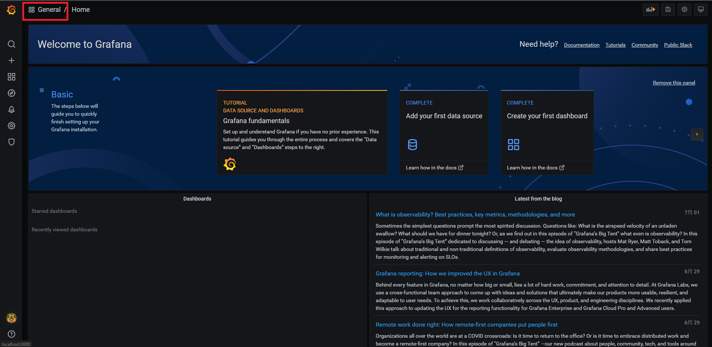
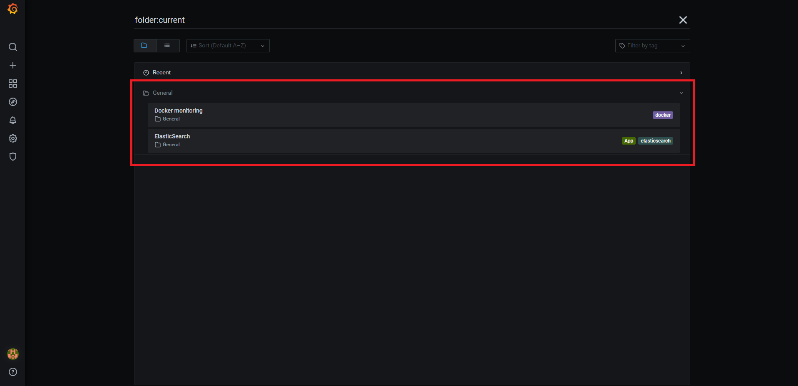
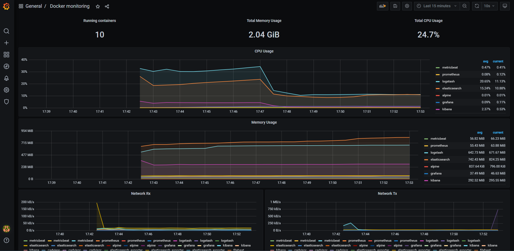
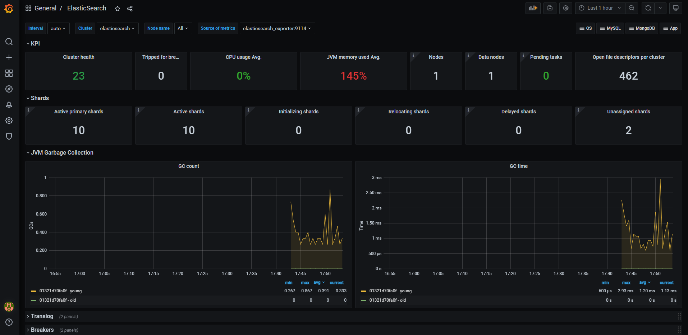

# ELFK-stack-monitor
## 👨‍💻簡介
- 🔰ELFK-stack：因最近在研究elk-stack，藉此紀錄一下使用docker-compose建立起elk-stack的架構，主要先從alpine產生假資料並存到filebeat讀取的資料夾，接著filebeat將資料送往logstash，在實務上，會在logstash做filter的功能(未來會新增)，接著送到elasticsearch存起來，並透過kibana的ui下去做搜尋所需的log資料。
- 🔰Monitor：使用cadvisor監控所有容器以及elasticsearch_exporter監控elasticsearch的狀態，並把資料送到prometheus儲存起來，最後透過grafana的ui呈現。

### 流程
- ⚙️ELFK-stack : alpine+filebeat(送資料) -> logstash(filter) -> elasticsearch(db) -> kibana(ui)
- ⚙️Monitor : cadvisor,elasticsearch_exporter(monitor) -> prometheus(db) -> grafana(ui)

## 環境建置
1. 使用docker-compose啟動服務
```shell
sudo docker-compose up -d
```
2. 進到` localhost:5601 `按照以下圖示設定index pattern


3. 可進到` localhost:3000 `查看grafana dashboard，帳密都為admin



- container-dashboard

- elasticsearch-dashboard


## 預計添加功能

- [ ] 新增log filter
- [ ] 添加ssl
- [ ] cluster架構的elastic
