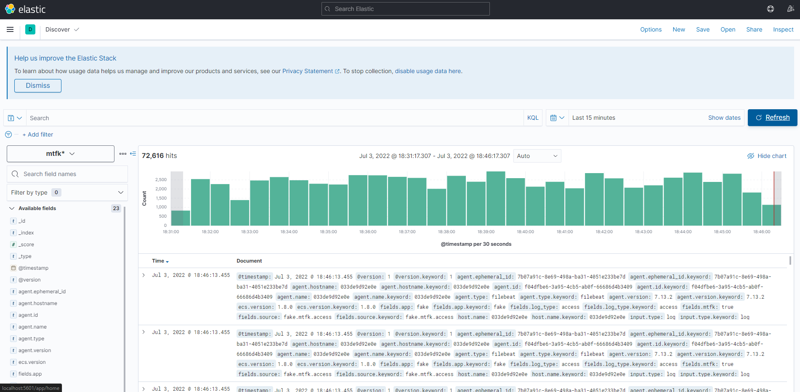

# ELFK-stack-monitor
## 簡介
- ELFK-stack : alpine+filebeat(送資料) -> logstash(filter) -> elasticsearch(db) -> kibana(ui)
- Monitor : elasticsearch_exporter,metricbeat(monitor) -> prometheus(db) -> grafana(ui)

## 環境建置
1. 使用docker-compose啟動服務
```shell
sudo docker-compose up -d
```
2. 進到` localhost:5601 `按照以下圖示設定index pattern


3. 可進到` localhost:3000 `查看grafana dashboard，帳密都為admin



## 預計添加功能

- [ ] 新增filter
- [ ] 添加ssl
- [ ] cluster架構的elastic
